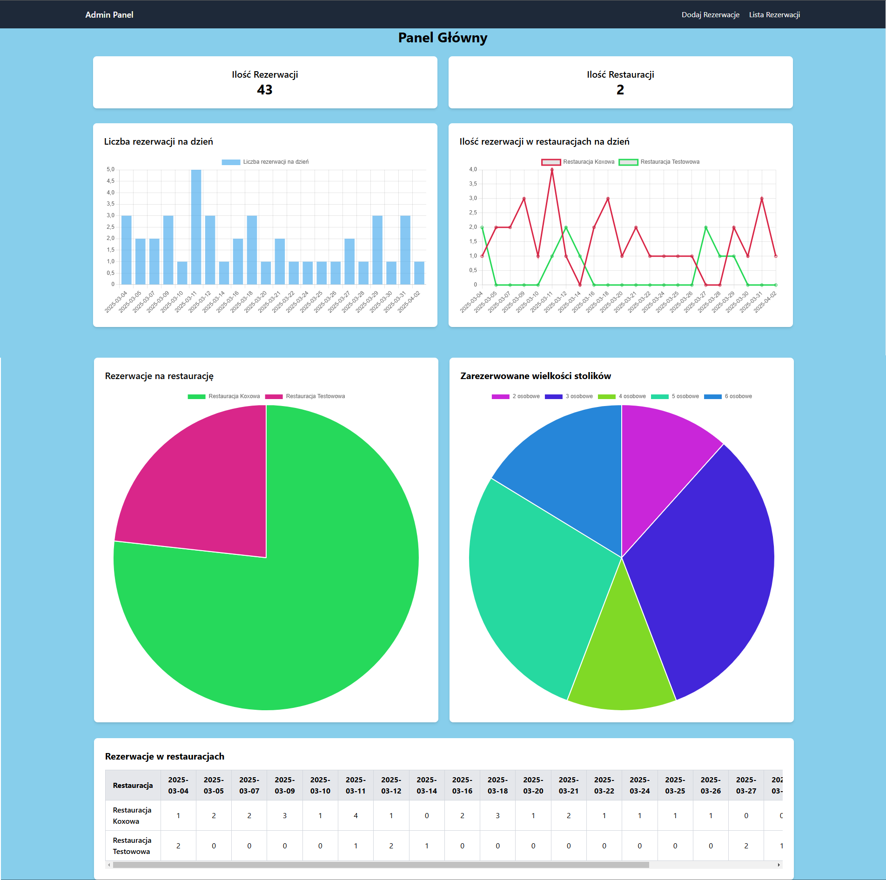
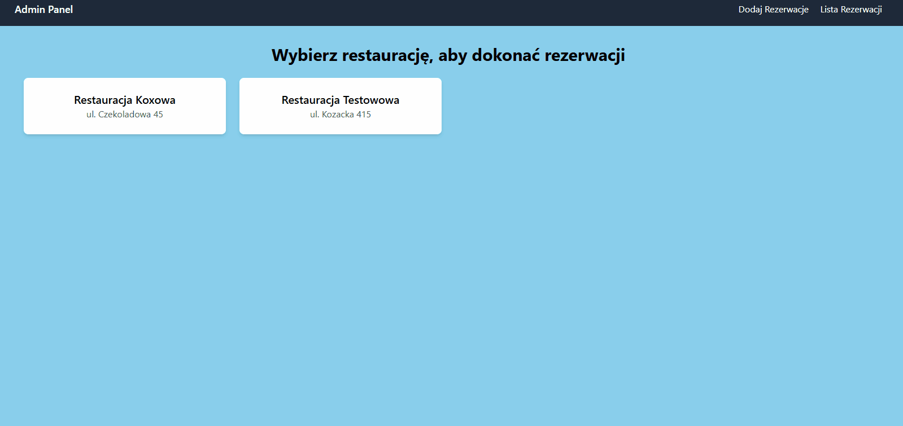
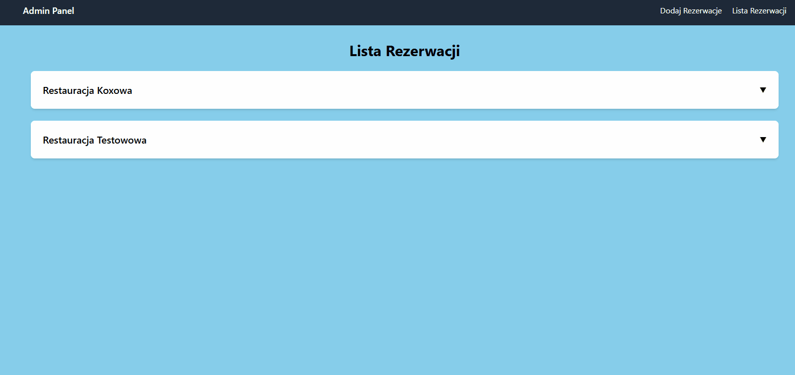

# 🍽️ System Rezerwacji Restauracji

System rezerwacji stolików dla restauracji, oparty na Symfony, Twig oraz TailwindCSS. Umożliwia zarządzanie rezerwacjami, wybór stolików oraz dynamiczne filtrowanie i sortowanie listy rezerwacji.



## 🚀 Funkcje

- ✅ **Dodawanie rezerwacji** poprzez interaktywny popup.
- 📅 **Filtrowanie i sortowanie** rezerwacji w tabeli.
- 🏢 **Wybór restauracji** i dostępnych stolików.
- 🎨 **Responsywny interfejs** oparty na TailwindCSS.

## 📸 Widoki

| Dodanie Rezerwacji  | Lista rezerwacji  |
|--------------------|------------------|
|  |  |

## 🛠️ Instalacja

1. Sklonuj repozytorium:
   ```sh
   git clone https://github.com/Ozatooo/Restaurant-Reservation.git
   cd repository
